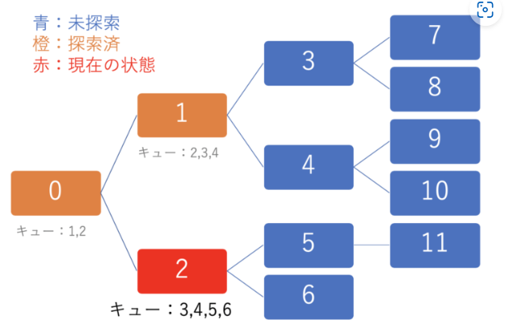

## 幅優先探索(Breadth First Search)

幅優先探索とは、全探索アルゴリズムの一種
最短経路を求める際に使用される基本的なアルゴリズム
木などのグラフやグラフと同一視できるものを探索する際に良く使われる

```
キューを用いたアルゴリズム：

始めの状態から遷移可能な状態を、全てキューに入れる
キューに要素がなければ終了する
現在の状態から遷移可能な状態を、全てキューに入れる
キューから1つ要素を取り出し、そこに状態を遷移させる
2.に戻る
```



