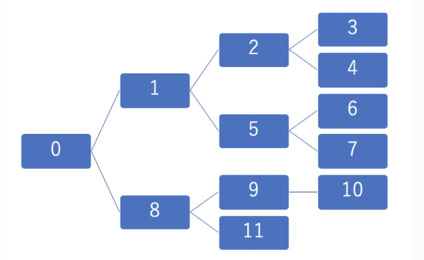

## 深さ優先探索(Depth First Search)

深さ優先探索とは、全探索アルゴリズムの一種です。グラフや、グラフと同一視できるものを探索する際に良く使われます。
幅優先探索(BFS)と似ていますが、深さ優先探索は末端に到達するまで「深く」探索してから、他のノードの探索を始めます。




## DFSのアルゴリズム
とりあえずこれ以上進めなくなるまで探索したら、戻って別のルートで探索し直す
```
スタックを用いたアルゴリズム：

始めの状態から遷移可能な状態を、全てスタックに入れる
スタックに要素がなければ終了する
現在の状態から遷移可能な状態を、全てスタックに入れる
スタックから1つ要素を取り出し、そこに状態を遷移させる
2.に戻る
```

